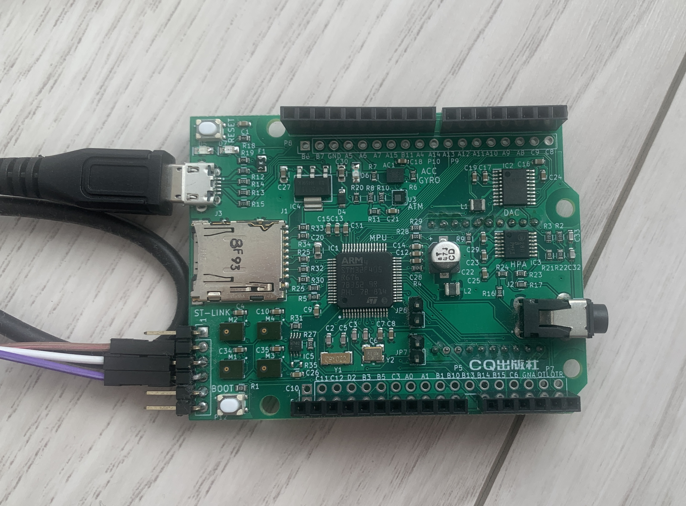

# 自作RTOS
Cortex-M4コア上で動作するITRON風(?)の自作RTOS  
ディスパッチはPendSV割り込みハンドラ内で行う実装となっているので``this各サービスコールはキュー操作の後、PendSV割り込み要求を行う。  
タスクコンテキスト、非タスクコンテキスト問わずサービルコールを呼べるようになっているので注意。（気が向いたら修正 and 変更)  
## Develepment Environment 
統合開発環境：STM32CubeIDE 1.14.0   
ボード：CQ出版社『STM32で始めるIoT実験教室』Arm-First(Cortex-M4)  

## Application  

## Device Driver 
PORT Driver

## RTOS Service Call 
### タスク管理  
ER cre_tsk(ID tskid, T_CTSK *pk_ctsk);  
ER wup_tsk(ID tskid);  
ER slp_tsk(TMO tmout);  
ER dly_tsk(RELTIM dlytim);  
### タスク間同期  
ER cre_sem(ID semid, T_CSEM *p_csem);  
ER del_sem(ID semid);  
ER wai_sem(ID semid, TMO tmout);  
ER sig_sem(ID semid);  
ER cre_flg(ID evtflgid, T_CFLG *p_cflg);  
ER del_flg(ID evtflgid);  
ER wai_flg(ID evtflgid, FLGPTN waiptn, MODE wfmode, FLGPTN *p_flgptn, TMO tmout);  
ER set_flg(ID evtflgid, FLGPTN setptn);  
ER clr_flg(ID evtflgid, FLGPTN clrptn);  
### タスク間通信  
ER cre_mbx(ID mbxid, T_CMBX *p_cmbx);  
ER del_mbx(ID mbxid);  
ER snd_mbx(ID mbxid, T_MSG *p_msg);  
ER rcv_mbx(ID mbxid, T_MSG **p_msg, TMO tmout);  
ER cre_mbf(ID mbfid, T_CMBF *p_cmbf);  
ER del_mbf(ID mbfid);  
ER snd_mbf(ID mbfid, VP msg, uint32_t msgsz, TMO tmout);  
ER_ID rcv_mbf(ID mbfid, VP msg, TMO tmout);  
### 周期ハンドラ  
ER cre_cyc(ID cycid, T_CCYC *p_ccyc);  
ER sta_cyc(ID cycid);  
ER stp_cyc(ID cycid);  
ER chg_pri(ID tskid, PRI tskpri);  
### メモリ管理  
ER cre_mpf(ID mpfid, T_CMPF *p_cmpf);  
ER del_mpf(ID mpfid);  
ER get_mpf(ID mpfid, VP *p_blk, TMO tmout);  

## Utility 
void *mem_alloc(uint32_t size);  
void mem_free(void *p_mbk);  
int32_t set_handler(uint32_t exp_no, INT_HDLR hdlr);  

## ToDo 
MPU 
Mutex  
Console Task  
Timer driver  
UART driver  
SPI driver  
I2C driver  
SD card driver  

